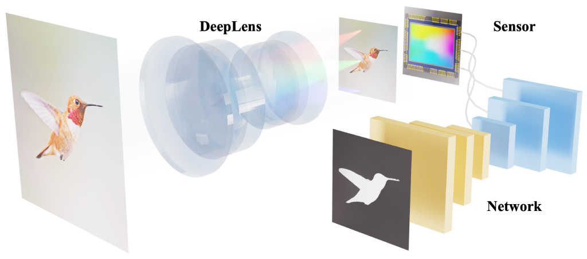
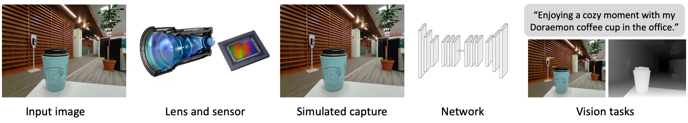
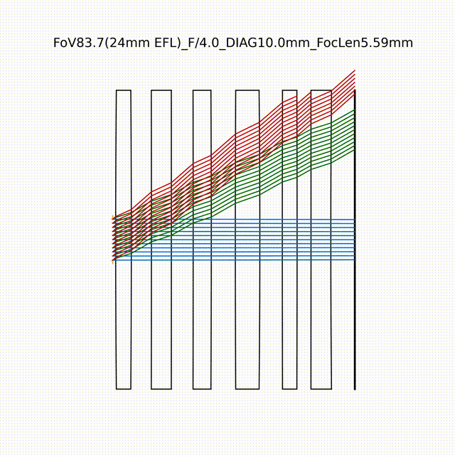
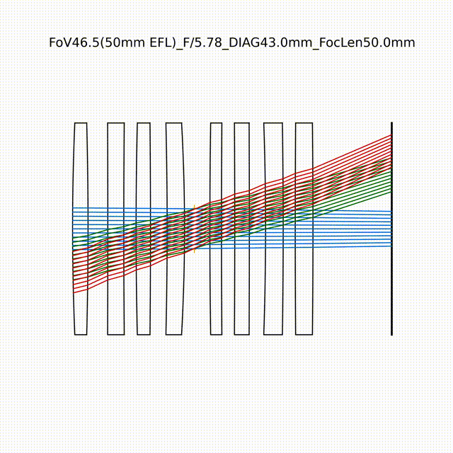
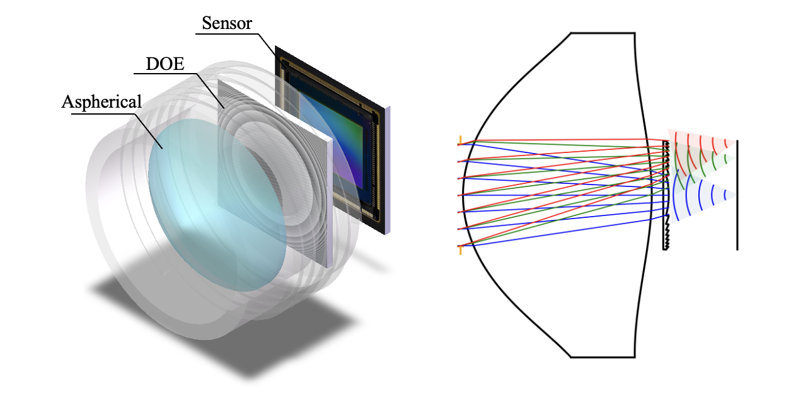
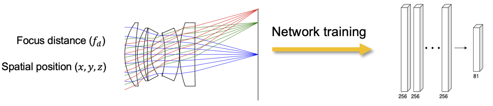

# End2endImaging

**End2endImaging** is an end-to-end differentiable computational imaging framework. It models the full camera pipeline — optics, sensor, and image processing — as a single differentiable computation graph built on PyTorch, enabling joint optimization of hardware and algorithms.

<div style="text-align:center;">
    
</div>

<p align="center">
    <a href="https://vccimaging.github.io/End2endImaging/">Docs</a> •
    <a href="#community">Community</a> •
    <a href="#citation">Citation</a>
</p>

## Features

### End-to-End Differentiable Pipeline

The core of End2endImaging is the `Camera` class, which composes a lens model and a sensor into a fully differentiable imaging pipeline. Gradients flow from downstream task losses (reconstruction, detection, classification) back through the neural network, sensor noise model, ISP, and into the optical design parameters — enabling hardware-software co-optimization.

#### DeepLens: Differentiable Optics

The [`deeplens/`](end2end_imaging/deeplens/) module provides differentiable lens models for optical simulation and design:

- **GeoLens** — Multi-element refractive lens via differentiable ray tracing. Supports Zemax/Code V/JSON I/O, automated lens design, Seidel aberration analysis, and tolerancing.
- **HybridLens** — Refractive lens + diffractive optical element (DOE). Coherent ray tracing + Angular Spectrum Method propagation.
- **DiffractiveLens** — Pure wave-optics lens using diffractive surfaces and scalar diffraction.
- **PSFNetLens** — Neural surrogate wrapping a GeoLens with an MLP for fast PSF prediction.
- **ParaxialLens** — Thin-lens model for depth-of-field and bokeh simulation.

#### Sensor & ISP Simulation
Physically accurate sensor simulation with Bayer CFA, read/shot noise model, and a composable ISP pipeline (black level, white balance, demosaicing, color correction, gamma, tone mapping). Each stage is a differentiable `torch.nn.Module`.

#### Neural Networks
Built-in reconstruction networks (NAFNet, UNet, Restormer) for restoring clean images from degraded sensor captures, plus PSF surrogate networks (MLP, SIREN) for fast PSF prediction during training.

### Additional features (available upon inquiry):

- **Kernel Acceleration.** >10x speedup and >90% GPU memory reduction with custom GPU kernels (NVIDIA & AMD).
- **Distributed Optimization.** Distributed simulation for billions of rays and high-resolution (>100k) diffractive computations.

## Applications

#### 1. End-to-End Camera Design

Jointly optimize lens optics and neural reconstruction using final image quality (or classification/detection/segmentation) as the objective.

[](https://www.nature.com/articles/s41467-024-50835-7)

<div align="center">
    
</div>

#### 2. Automated Lens Design

Fully automated lens design from scratch using curriculum learning and differentiable optimization. Try it with [AutoLens](https://github.com/vccimaging/AutoLens)!

[](https://www.nature.com/articles/s41467-024-50835-7) [](https://github.com/vccimaging/AutoLens)

<div align="center">
    
    
</div>

#### 3. Hybrid Refractive-Diffractive Lens Design

Design hybrid refractive-diffractive lenses with a new ray-wave model.

[](https://arxiv.org/abs/2406.00834)

<div align="center">
    
</div>

#### 4. Implicit Lens Representation

A surrogate network for fast (aberration + defocus) image simulation.

[](https://ieeexplore.ieee.org/document/10209238) [](https://github.com/vccimaging/Aberration-Aware-Depth-from-Focus)

<div align="center">
    
</div>

## Installation

Clone this repo:

```
git clone https://github.com/vccimaging/End2endImaging
cd End2endImaging
```

Create a conda environment:
```
conda create -n end2end_env python=3.12
conda activate end2end_env

# Linux and Mac
pip install torch torchvision
# Windows
pip install torch torchvision --index-url https://download.pytorch.org/whl/cu128

pip install -r requirements.txt
```
or
```
conda env create -f environment.yml -n end2end_env
```

Run the demo code:
```
python 0_hello_deeplens.py
```

## Project Structure

```
End2endImaging/
│
├── end2end_imaging/
│   ├── camera.py          # Camera: composes lens + sensor into a differentiable pipeline
│   ├── deeplens/          # Differentiable optics (lens models, surfaces, ray tracing)
│   ├── sensor/            # Sensor simulation (Bayer CFA, noise, ISP pipeline)
│   └── network/           # Neural networks (reconstruction, PSF surrogates, losses)
│
├── 0_hello_deeplens.py    # Code tutorials
├── ...
└── write_your_own_code.py
```

## Community

Join our [Slack](https://join.slack.com/t/deeplens/shared_invite/zt-2wz3x2n3b-plRqN26eDhO2IY4r_gmjOw) workspace and WeChat Group (singeryang1999) to connect with our core contributors, receive the latest industry updates, and be part of our community. For any inquiries, contact Xinge Yang (xinge.yang@kaust.edu.sa).

## Contribution

We welcome all contributions. To get started, please read our [Contributing Guide](./CONTRIBUTING.md) or check out [open questions](https://github.com/users/singer-yang/projects/2). All project participants are expected to adhere to our [Code of Conduct](./CODE_OF_CONDUCT.md). A list of contributors can be viewed in [Contributors](./CONTRIBUTORS.md) and below:

<a href="https://github.com/singer-yang/DeepLens/graphs/contributors">
  
</a>

## Citation

If you use this project in your research, please cite the paper. See more in [History of DeepLens](./CITATION.md).

```bibtex
@article{yang2024curriculum,
  title={Curriculum learning for ab initio deep learned refractive optics},
  author={Yang, Xinge and Fu, Qiang and Heidrich, Wolfgang},
  journal={Nature communications},
  volume={15},
  number={1},
  pages={6572},
  year={2024},
  publisher={Nature Publishing Group UK London}
}
```
